# Ophel Atlas - AI 对话结构化与导航工具

## 项目愿景

Ophel 是一款跨平台浏览器扩展（同时支持油猴脚本），将 AI 对话转化为可阅读、可导航、可复用的知识内容。通过实时大纲、会话文件夹与 Prompt 词库，让 AI 对话告别无限滚动，成为可组织、可沉淀的工作流。

支持站点：Gemini、Gemini Enterprise、AI Studio、ChatGPT、Grok、Claude。

## 架构总览

### 技术栈

| 类别 | 技术 |
|------|------|
| 语言 | TypeScript 5.3 |
| UI 框架 | React 18 |
| 状态管理 | Zustand 5 (persist 中间件 + chrome.storage.local) |
| 扩展框架 | Plasmo 0.90 (Manifest V3, Chrome + Firefox) |
| 油猴构建 | Vite + vite-plugin-monkey |
| 样式 | 纯 CSS（无 CSS-in-JS 或预处理器） |
| 包管理 | pnpm 9.15 |
| 代码质量 | ESLint 9 (flat config) + Prettier + TypeScript 严格模式 |
| Git 规范 | Husky + lint-staged + commitlint (Conventional Commits) |
| 文档站 | VitePress (中/英双语) |
| 函数式库 | Effect (用于部分核心逻辑) |

### 架构模式

本项目采用 **适配器模式 (Adapter Pattern)** 实现多站点支持：

```
Content Script (main.ts)
    |
    v
getAdapter() --> SiteAdapter (抽象基类)
    |               |
    |               +-- GeminiAdapter
    |               +-- GeminiEnterpriseAdapter
    |               +-- ChatGPTAdapter
    |               +-- ClaudeAdapter
    |               +-- GrokAdapter
    |               +-- AIStudioAdapter
    |
    v
initCoreModules(ctx) --> 11 个核心模块
    |
    v
App.tsx (Shadow DOM 内的 React 面板)
```

### 双平台构建

项目同时支持浏览器扩展和油猴脚本两种分发形式：

- **浏览器扩展**：通过 Plasmo 构建，使用 `chrome.*` API
- **油猴脚本**：通过 Vite + vite-plugin-monkey 构建，使用 `GM_*` API
- **平台抽象层**：`src/platform/` 提供统一接口，构建时通过 `__PLATFORM__` 变量切换实现

## 模块结构图

```mermaid
graph TD
    Root["Ophel (根)"] --> SRC["src/"]
    Root --> DOCS["docs/"]
    Root --> LOCALES["locales/"]
    Root --> ASSETS["assets/"]

    SRC --> ADAPTERS["adapters/"]
    SRC --> CORE["core/"]
    SRC --> COMPONENTS["components/"]
    SRC --> STORES["stores/"]
    SRC --> CONTENTS["contents/"]
    SRC --> PLATFORM["platform/"]
    SRC --> UTILS["utils/"]
    SRC --> CONSTANTS["constants/"]
    SRC --> HOOKS["hooks/"]
    SRC --> LOCALES_SRC["locales/ (i18n 资源)"]
    SRC --> STYLES["styles/"]
    SRC --> TABS["tabs/"]
    SRC --> TYPES["types/"]

    ADAPTERS --> A_BASE["base.ts (SiteAdapter 抽象基类)"]
    ADAPTERS --> A_GEMINI["gemini.ts"]
    ADAPTERS --> A_GE["gemini-enterprise.ts"]
    ADAPTERS --> A_CHATGPT["chatgpt.ts"]
    ADAPTERS --> A_CLAUDE["claude.ts"]
    ADAPTERS --> A_GROK["grok.ts"]
    ADAPTERS --> A_AI["aistudio.ts"]

    CORE --> C_MOD["modules-init.ts (模块编排)"]
    CORE --> C_OUTLINE["outline-manager.ts"]
    CORE --> C_CONV["conversation/ (会话管理)"]
    CORE --> C_THEME["theme-manager.ts"]
    CORE --> C_COPY["copy-manager.ts"]
    CORE --> C_LAYOUT["layout-manager.ts"]
    CORE --> C_MODEL["model-locker.ts"]
    CORE --> C_SCROLL["scroll-lock-manager.ts"]
    CORE --> C_TAB["tab-manager.ts"]
    CORE --> C_WEBDAV["webdav-sync.ts"]
    CORE --> C_PROMPT["prompt-manager.ts"]
    CORE --> C_QUEUE["queue-dispatcher.ts"]
    CORE --> C_OTHER["...其他管理器"]

    PLATFORM --> P_EXT["extension/ (Chrome API)"]
    PLATFORM --> P_US["userscript/ (GM_* API)"]
```



## 模块索引

| 模块路径 | 职责 | 关键文件 |
|----------|------|----------|
| `src/adapters/` | 多站点适配器层，基于 `SiteAdapter` 抽象基类，每个站点一个实现 | `base.ts`, `gemini.ts`, `chatgpt.ts`, `claude.ts`, `grok.ts`, `aistudio.ts`, `gemini-enterprise.ts` |
| `src/core/` | 核心业务模块（11 个管理器），由 `modules-init.ts` 统一编排 | `modules-init.ts`, `outline-manager.ts`, `theme-manager.ts`, `layout-manager.ts`, `conversation/`, `webdav-sync.ts` |
| `src/components/` | React UI 层，运行在 Shadow DOM 中 | `App.tsx`, `MainPanel.tsx`, `OutlineTab.tsx`, `ConversationsTab.tsx`, `SettingsModal.tsx`, `global-search/` |
| `src/stores/` | Zustand 状态管理，persist 到 chrome.storage.local | `settings-store.ts`, `conversations-store.ts`, `prompts-store.ts`, `folders-store.ts`, `tags-store.ts` |
| `src/contents/` | Plasmo Content Script 入口 | `main.ts`（逻辑入口）, `ui-entry.tsx`（UI 入口/Shadow DOM） |
| `src/platform/` | 平台抽象层（浏览器扩展 vs 油猴脚本） | `types.ts`, `index.ts`, `extension/`, `userscript/` |
| `src/utils/` | 工具函数 | `i18n.ts`, `dom-toolkit.ts`, `exporter.ts`, `markdown.ts`, `themes/`, `scroll-helper.ts` |
| `src/constants/` | 常量与默认配置 | `defaults.ts`（SITE_IDS）, `ui.ts`, `shortcuts.ts`, `tools-menu.ts` |
| `src/hooks/` | React Hooks | `useDraggable.ts`, `useShortcuts.ts` |
| `src/locales/` | 应用内 i18n 资源（10 种语言） | `resources.ts`, `zh-CN/`, `en/`, `ja/`, `ko/`, `de/`, `es/`, `fr/`, `pt/`, `ru/`, `zh-TW/` |
| `src/tabs/` | 独立页面（选项页、权限请求页） | `options.tsx`, `options/pages/`, `perm-request.tsx` |
| `src/styles/` | 全局样式 | `conversations.css`, `settings.css`, `theme-variables.css`, `queue-overlay.css` |
| `locales/` | Chrome 扩展 manifest 多语言（_locales 等价） | `zh_CN/messages.json`, `en/messages.json` 等 10 种语言 |
| `docs/` | VitePress 文档站（中英双语） | `zh/`, `en/`, `.vitepress/config.mts` |
| `assets/` | 静态资源（图标、截图、音效） | `icon.png`, `store/`, `demo/` |

## 运行与开发

### 环境要求

- Node.js >= 18
- pnpm >= 9.15

### 常用命令

```bash
# 安装依赖
pnpm install

# 开发模式（浏览器扩展）
pnpm dev

# 开发模式（油猴脚本）
pnpm dev:userscript

# 构建浏览器扩展 (Chrome)
pnpm build

# 构建 Firefox 扩展
pnpm build:firefox

# 构建所有平台
pnpm build:all

# 构建油猴脚本
pnpm build:userscript

# 打包扩展（发布用）
pnpm package
pnpm package:all

# 代码检查
pnpm lint          # ESLint 自动修复
pnpm lint:check    # ESLint 只检查
pnpm format        # Prettier 格式化
pnpm format:check  # Prettier 只检查
pnpm typecheck     # TypeScript 类型检查

# 文档站
pnpm docs:dev      # 本地预览
pnpm docs:build    # 构建文档
```

### 关键入口文件

| 入口 | 路径 | 说明 |
|------|------|------|
| Content Script 逻辑入口 | `src/contents/main.ts` | 初始化适配器和核心模块 |
| Content Script UI 入口 | `src/contents/ui-entry.tsx` | Shadow DOM 内挂载 React App |
| Background Service Worker | `src/background.ts` | 消息处理、通知、代理请求、Cookie 管理 |
| Popup 页面 | `src/popup.tsx` | 扩展弹出窗口 |
| Options 页面 | `src/tabs/options.tsx` | 独立设置页面 |
| 油猴脚本入口 | `src/platform/userscript/entry.tsx` | Vite 构建入口 |

### 路径别名

项目使用 `~` 前缀作为 `src/` 的别名（在 `tsconfig.json` 和 `vite.userscript.config.ts` 中配置）：

```typescript
import { SiteAdapter } from "~adapters/base"
import { useSettingsStore } from "~stores/settings-store"
```

## 核心模块详解

### 适配器层 (`src/adapters/`)

`SiteAdapter` 抽象基类定义了所有站点必须实现的接口：

- `match()` / `getSiteId()` / `getName()` - 站点识别
- `getTextareaSelectors()` / `insertPrompt()` - 输入框交互
- `extractOutline()` - 大纲提取
- `getConversationList()` / `navigateToConversation()` - 会话管理
- `getExportConfig()` - 导出配置
- `lockModel()` - 模型锁定（通用实现在基类中）

支持的站点标识（`SITE_IDS`）：`gemini`, `gemini-enterprise`, `chatgpt`, `claude`, `grok`, `aistudio`

### 核心模块 (`src/core/modules-init.ts`)

`initCoreModules()` 按以下顺序初始化 11 个管理器：

1. **ThemeManager** - 主题管理（light/dark/system + 自定义预设样式）
2. **MarkdownFixer** - AI 响应中的 Markdown 渲染修复
3. **LayoutManager** - 页面宽度、用户提问宽度、禅模式（Zen Mode）
4. **CopyManager** - 公式复制（LaTeX）、表格复制
5. **TabManager** - 标签页自动重命名、隐私模式
6. **WatermarkRemover** - Gemini 去水印（Banana 功能）
7. **ReadingHistoryManager** - 阅读历史记录与进度恢复
8. **ModelLocker** - 模型锁定（自动切换到指定模型）
9. **ScrollLockManager** - 滚动锁定
10. **UserQueryMarkdownRenderer** - 用户提问 Markdown 渲染
11. **PolicyRetryManager** - Gemini Enterprise 策略重试

所有模块支持通过 `subscribeModuleUpdates()` 响应设置变化的热更新。

### 状态管理 (`src/stores/`)

使用 Zustand + persist 中间件，数据持久化到 `chrome.storage.local`：

- **settings-store** - 全局设置（主题、功能开关、站点特定配置）
- **conversations-store** - 会话元数据（标题、文件夹、标签、置顶）
- **prompts-store** - 提示词库
- **folders-store** - 文件夹管理
- **tags-store** - 标签管理
- **queue-store** - Prompt 队列
- **anchor-store** - 大纲锚点
- **bookmarks-store** - 书签
- **reading-history-store** - 阅读历史
- **claude-sessionkeys-store** - Claude Session Key 管理

### 全局搜索 (`src/components/global-search/`)

支持语法化搜索的全局搜索功能：

- `syntax.ts` - 搜索语法解析器（支持 `folder:`, `tag:`, `site:` 等过滤器）
- `useGlobalSearchData.ts` - 数据源聚合
- `useGlobalSearchKeyboard.ts` - 键盘导航
- `useGlobalSearchPreview.ts` - 预览面板
- `useGlobalSearchSyntax.ts` - 语法高亮与补全

### Background Service Worker (`src/background.ts`)

处理以下消息类型：

- `MSG_SHOW_NOTIFICATION` - 桌面通知
- `MSG_PROXY_FETCH` - 代理请求（绕过 CORS，用于图片 Base64 转换）
- `MSG_WEBDAV_REQUEST` - WebDAV 同步请求
- `MSG_CHECK_PERMISSION` / `MSG_REQUEST_PERMISSIONS` - 权限管理
- `MSG_SET_CLAUDE_SESSION_KEY` / `MSG_SWITCH_NEXT_CLAUDE_KEY` / `MSG_TEST_CLAUDE_TOKEN` - Claude 账号管理
- `MSG_GET_AISTUDIO_MODELS` - AI Studio 模型列表获取
- `MSG_CLEAR_ALL_DATA` - 全量数据清除

## 测试策略

**当前状态：项目尚未建立测试体系。** 源码中无 test/spec 文件，`package.json` 中无测试相关命令或依赖（如 Jest、Vitest、Playwright）。

建议优先引入的测试：
1. **单元测试**：适配器的 `match()` / `getSiteId()` 逻辑、`backup-validator.ts`、`format.ts`、`syntax.ts`（搜索语法解析）
2. **集成测试**：`modules-init.ts` 的模块编排、`webdav-sync.ts` 的同步逻辑
3. **E2E 测试**：使用 Playwright + 浏览器扩展测试框架验证核心用户流程

## CSS 架构

### 样式文件清单

项目共 **7 个 CSS 文件**（纯原生 CSS，无预处理器），总计 ~5,974 行：

| 文件路径 | 行数 | 用途 |
|---------|------|------|
| `src/style.css` | 1,472 | 主样式（大纲面板、快捷按钮、tooltip 等核心 UI） |
| `src/styles/settings.css` | 2,081 | 设置页面（Options Page）样式 |
| `src/styles/conversations.css` | 1,313 | 会话 Tab 样式（文件夹、标签、搜索、批量操作） |
| `src/styles/queue-overlay.css` | 395 | Prompt Queue 排队叠加层样式 |
| `src/styles/theme-variables.css` | 286 | CSS 变量定义文件（浅色/深色模式默认值） |
| `src/popup.css` | 395 | 浏览器扩展 Popup 页面样式 |
| `src/tabs/options.css` | 32 | Options 页面入口（仅 @import） |

### 样式技术方案

| 维度 | 方案 |
|------|------|
| 预处理器 | 无（纯原生 CSS） |
| CSS 框架 | 无（全部手写） |
| CSS-in-JS | 无（外部 CSS 文件 + React 内联 style 混合） |
| 主题系统 | CSS 变量 + TypeScript 预设 + 运行时动态注入 |
| 样式隔离 | Shadow DOM（`:host` 选择器 + 动态 style 注入） |
| 命名前缀 | `--gh-*`（项目前身 Gemini Helper 缩写） |
| 布局 | Flexbox 为主，Grid 辅助，固定定位用于浮动 UI |
| 响应式 | 极少媒体查询，主要依赖 JS 动态类名（`.is-narrow`） |
| 现代特性 | `color-mix()`、`backdrop-filter`、View Transitions、`scrollbar-width` |

### 主题系统

**架构**：`src/utils/themes/` 目录，TypeScript 预设对象 + CSS 变量动态注入。

**目录结构：**
```
src/utils/themes/
  index.ts       -- 统一导出
  types.ts       -- ThemeVariables 接口（60+ CSS 变量键名）、ThemePreset 接口
  helpers.ts     -- 查找预设、CSS 转换、解析工具函数
  dark/index.ts  -- 12 个暗色主题预设
  light/index.ts -- 12 个亮色主题预设
```

**主题列表**：亮色 12 个（默认 `google-gradient`），暗色 12 个（默认 `classic-dark`）。支持 `light` / `dark` / `system` 三种模式。

**核心控制器**：`src/core/theme-manager.ts`（943 行）
- 多站点主题检测（ChatGPT、Gemini、Claude 等各有不同的检测策略）
- MutationObserver 监听 `body`/`html` 的 `class`、`data-theme`、`style` 属性变化
- View Transitions API 圆形扩散动画（从点击位置辐射展开）
- Shadow DOM 注入：查找 `plasmo-csui` 和 `#ophel-userscript-root` 两种 Shadow Host，通过 `<style id="gh-theme-vars">` 注入变量
- 提供 `subscribe()` / `getSnapshot()` 方法，支持 React `useSyncExternalStore`

### CSS 变量体系

**命名规范**：`--gh-{语义域}-{属性}[-{状态}]`，总计约 **87 个变量**。

| 分类 | 示例 |
|------|------|
| 基础背景 | `--gh-bg`, `--gh-bg-secondary`, `--gh-bg-tertiary` |
| 文字颜色 | `--gh-text`, `--gh-text-secondary`, `--gh-text-tertiary` |
| 边框/交互 | `--gh-border`, `--gh-hover`, `--gh-active-bg` |
| 输入框 | `--gh-input-bg`, `--gh-input-border`, `--gh-input-focus-border` |
| 品牌色 | `--gh-primary`, `--gh-secondary`, `--gh-danger` |
| 阴影 | `--gh-shadow`, `--gh-shadow-sm`, `--gh-shadow-lg` |
| 文件夹色板 | `--gh-folder-bg-0` ~ `--gh-folder-bg-7`（10 个） |
| 大纲高亮 | `--gh-outline-locate-bg`, `--gh-outline-sync-*` |
| 玻璃拟态 | `--gh-glass-*` |
| 分类颜色 | `--gh-category-1` ~ `--gh-category-7` |

**特殊前缀**：`--popup-*`（Popup 页面独立体系）、`--panel-width`（布局动态变量）、`--theme-x/y`（View Transitions 坐标）。

变量引用统一使用 `var(--gh-*, fallback)` 形式并带硬编码回退值。

### Shadow DOM 样式注入

**两种 Shadow Host**：`<plasmo-csui>`（扩展模式）、`<div id="ophel-userscript-root">`（油猴模式）。

**静态样式**（初始化时）：`ui-entry.tsx` 通过 `getStyle()` 将三个 CSS 文件合并注入 Shadow DOM `<style>` 标签。

**动态主题变量**（切换时）：`ThemeManager.syncPluginUITheme()` 创建/更新 `<style id="gh-theme-vars">`，注入 `:host { ... }` 规则到各 Shadow Root。

**CSS 导入方式**：
- Plasmo 扩展：`import cssText from "data-text:~style.css"`（编译时转字符串）
- 油猴脚本：`import mainStyle from "../../style.css?inline"`（Vite 内联）
- 常规页面：`import "./popup.css"`（直接导入）

### CSS 动画

项目定义了多个 `@keyframes` 动画：`tooltip-fade-in`、`outlineLocatePulse`（定位呼吸光晕）、`quick-btn-hold-fill`（长按填充进度）、`quick-menu-enter`（菜单弹出缩放）、`gh-scanline`/`gh-mist-drift`（背景纹理动画）等。主题切换使用 View Transitions API 实现圆形扩散过渡效果。

## 编码规范

### 提交规范 (Conventional Commits)

```
type(scope): subject

# type 可选值：
feat, fix, docs, style, refactor, perf, test, build, ci, chore, revert, deps, ux

# 约束：
- header 最长 100 字符
- scope 使用小写
- body/footer 前必须空行
- commit message 必须使用英文
```

### ESLint 规则要点

- React Hooks 规则强制执行
- `@typescript-eslint/no-unused-vars`：warn（`_` 前缀参数/变量忽略）
- `@typescript-eslint/no-explicit-any`：warn
- `no-console`：warn（允许 `console.warn` 和 `console.error`）
- 不强制 React import（React 17+ JSX Transform）

### 代码风格

- Prettier 统一格式化
- 路径别名使用 `~` 前缀映射到 `src/`
- CSS 类名前缀使用 `gh-`（历史命名，来自项目前身）
- 组件内中文注释，代码标识符使用英文

### 国际化

- 应用内 i18n：`src/locales/` 下 10 种语言，通过 `~utils/i18n` 的 `t()` 函数调用
- 扩展 manifest 国际化：`locales/` 下对应 Chrome `_locales` 规范
- 支持语言：中文简体、中文繁体、英语、日语、韩语、德语、西班牙语、法语、葡萄牙语(巴西)、俄语

## AI 使用指引

### 修改代码时的注意事项

1. **适配器修改**：修改某个站点的适配器时，注意检查 `SiteAdapter` 基类的默认实现是否仍然适用
2. **新站点支持**：新增站点需要创建适配器类并在 `src/adapters/index.ts` 中注册
3. **设置项变更**：新增设置项需同步更新 `DEFAULT_SETTINGS`（在 `~utils/storage` 中）、对应的 store 和 UI 页面
4. **平台兼容性**：修改核心逻辑时注意浏览器扩展和油猴脚本的差异，通过 `src/platform/` 抽象层处理
5. **Shadow DOM**：面板 UI 运行在 Shadow DOM 中，样式隔离；需要穿透 DOM 查询时使用 `DOMToolkit`
6. **模块热更新**：`subscribeModuleUpdates()` 负责在设置变化时动态更新模块，新增模块需在此处添加更新逻辑
7. **备份兼容性**：`ZUSTAND_KEYS` 和 `MULTI_PROP_STORES` 常量影响备份导出/导入逻辑
8. **CSS 类名前缀**：扩展注入页面的 CSS 使用 `gh-` 前缀避免冲突

### 关键路径

- 用户操作流程：`popup.tsx` -> 支持站点检测 -> Content Script 注入 -> `main.ts` 初始化适配器 -> `modules-init.ts` 初始化模块 -> `ui-entry.tsx` 挂载 Shadow DOM -> `App.tsx` 渲染面板
- 设置同步流程：UI 操作 -> `useSettingsStore.updateNestedSetting()` -> Zustand persist -> `chrome.storage.local` -> `subscribeModuleUpdates()` 热更新模块
- 会话管理流程：`ConversationObserverConfig` 观察 DOM -> `ConversationManager` 聚合数据 -> `conversations-store` 持久化
- WebDAV 同步流程：`WebDAVSyncManager` -> `MSG_WEBDAV_REQUEST` -> Background SW 代理 -> WebDAV 服务器

## 变更记录 (Changelog)

| 日期 | 操作 | 说明 |
|------|------|------|
| 2026-03-04 | 初始创建 | 全仓扫描生成，覆盖率 ~92% |
| 2026-03-04 | CSS 架构分析 | 补充完整 CSS 架构文档：7 个样式文件、主题系统、CSS 变量体系、Shadow DOM 注入机制 |
